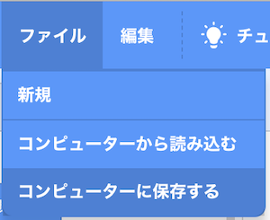
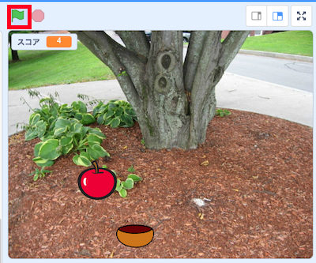
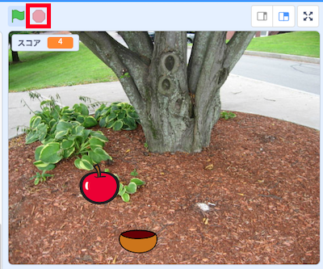

# 1. はじめに(Introduction)

このドキュメントでは、[Scratch 3.0](https://scratch.mit.edu/download)を使った『色々な場所から落ちてくるリンゴを捕る』ゲームの作成方法を説明します。

This document explains how to create a game called "Catching Apples Falling from Various Places" using [Scratch 3.0](https://scratch.mit.edu/download).

ドキュメント作成者：神長 貴博(NTTテクノクロス株式会社)

Document Author：Takahiro Jincho(NTT TechnoCross Corporation)

# 2. 準備:開発環境(Preparation:Development environment)

- [Scratch公式サイト(https://scratch.mit.edu/download)](https://scratch.mit.edu/download)から、Scratch 3.0をダウンロード、インストールする。(Scratch 3.0は、Windows、macOS、chromeOS、Androidに対応。(2020/04/13時点))

    Download and install Scratch 3.0 from the [Scratch official website(https://scratch.mit.edu/download)](https://scratch.mit.edu/download).(Scratch 3.0 is compatible with Windows, macOS, chromeOS, Android. (As of 2020/04/13))

# 3. 作り方(How to develop)

このゲームは、以下3つのプログラムで構成されています。

This game consists of the following three programs.

- ボウル(Bowl)
- リンゴ(Apple)
- 背景(Background)

ここでは、各プログラムの作り方を説明します。

以下表のプログラム名をクリックすると、プログラムの説明が表示されます。

プログラムは **『ボウル→リンゴ→背景』の順番で作成** します。

In this section, i will explain how to make each program.

Click on a program name in the table below to see a description of the program.

Develop the program in the order of "Bowl -> Apple -> Background".

| プログラム名(Program name) | 概要(Overview) |
|:----|:----|
| [ボウル](bowl.md) | ボウルのプログラムの説明(Bowls's program description) |
| [リンゴ](apple.md) | リンゴのプログラムの説明(Apple's program description) |
| [背景](background_music.md) | 背景のプログラムの説明(Background program description) |

# 4. プログラムの保存方法(How to save the program)

Scrachのファイルのメニューから『コンピューターに保存する』を選択し、実行してください。

From the Scrach file menu, select "Save to computer" and run it.

# 5. プログラムの実行・停止方法(How to run and stop the program)

## 5-1. プログラムを実行(Run the program)

旗のボタンを押してください。

Press the flag button.

## 5-2. プログラムを停止(Stop the program)

赤いボタンを押してください。

Press the red button.

