# リンゴのプログラムの作り方(How to develop an apple program)

## 1. 前提(Premise)

**[ボウル](bowl.md)のプログラムが完成** していること。

Bowl's program is complete.

## 2. プログラムを作る前の準備(Preparation before develop the program)

- ボタンをダブルクリックする。

    Double-click on the  button.

- 表示される画面でリンゴ(Apple)をクリックする。

    Select an apple and click on it.

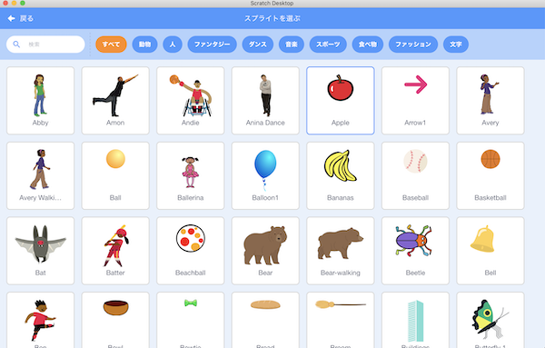

- スプライトが設定されていることを確認する。

    Confirm that the selected sprite is set.

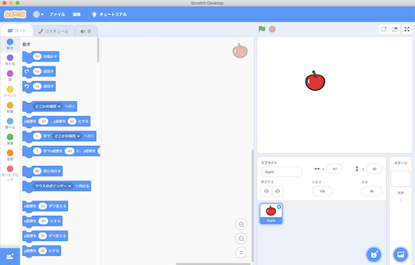

## 3. プログラムの作り方(How to develop a program)

### 3-1. 完成イメージ(Completed image)

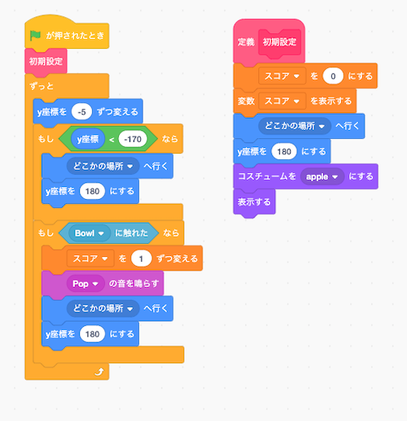

### 3-2. 作り方(How to develop)

- を押してください。

    Press .

- を押してください。

    Press .

- 以下の画面が表示されるので、 **『ブロック名』を『初期設定』に変更** してから、OKボタンを押してください。

    When the following screen is displayed, change the "Block Name" to "Initial Settings" and press the OK button.

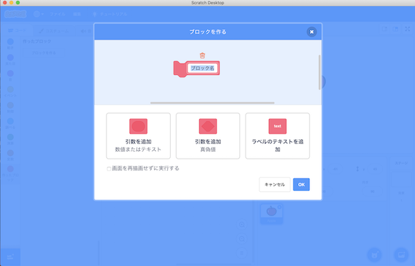

- 以下の画面が表示されることを確認してください。

    Confirm that the following screen is displayed.

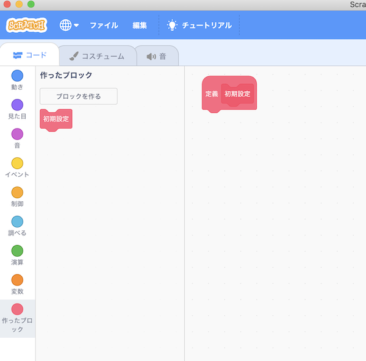

- を押してください。

    Press .

- を押してください。

    Press .

- 以下の画面が表示されるので、 **『新しい変数名：』に『スコア』と入力** してから、OKボタンを押してください。

    Enter "score" in "New variable name:" and press the OK button.

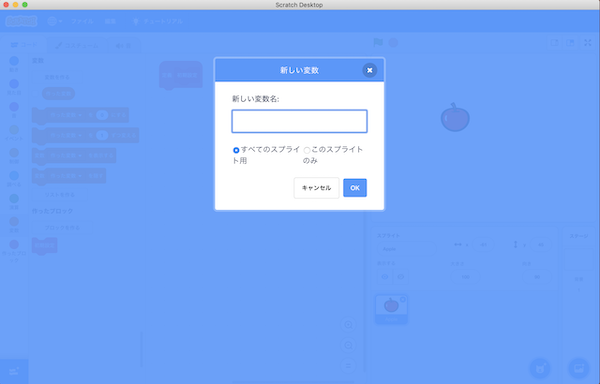

- **変数『スコア』が追加されていることを確認** してください。

    Confirm that the variable "Score" is added.

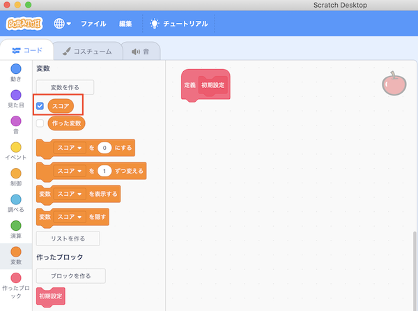

- 以下のブロックを画面中央にドラック＆ドロップします。

    Drag and drop the following blocks to the center of the screen.

　 

 

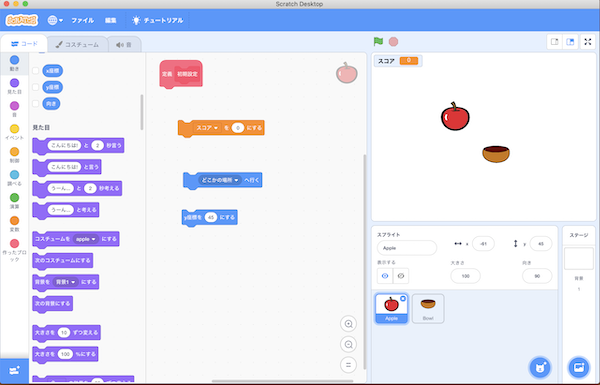

- の数字を **180に変更** します。(数字をダブルクリックすることで、数字を編集できる状態になります。)

    Change the number  to 180. (Double-clicking on a number, you will be able to edit the number.)

- 変更後、ブロックをくっつけてください。

    After the change, connect the blocks.

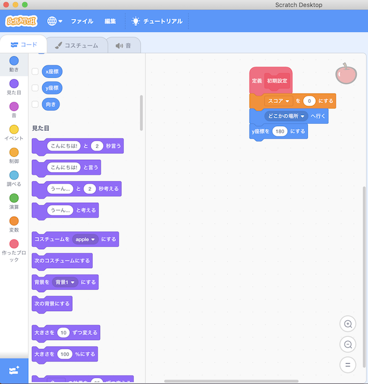

- 以下のブロックを画面中央にドラック＆ドロップします。

    Drag and drop the following blocks to the center of the screen.

　×2 ×2  

 

 

  ×2

 

 

 

 

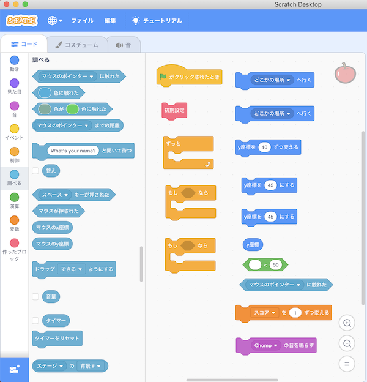

- のにをドラッグ＆ドロップします。

    Drag and drop  to  for .

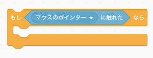

- の▼を押し、 **『マウスのポインター』から『Bowl』に変更** します。

    Press ▼ on A to change the "Mouse Pointer" to "Bowl".

- のにをドラッグ＆ドロップします。

    Drag and drop  to  for .

- のにをドラッグ＆ドロップします。

    Drag and drop  to  for .

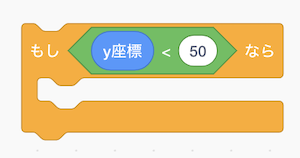

- の数字を **-170に変更** します。(数字をダブルクリックすることで、数字を編集できる状態になります。)

    Change the number  to -170. (Double-clicking on a number, you will be able to edit the number.)

- の数字を **180に変更** します。(数字をダブルクリックすることで、数字を編集できる状態になります。)(これを2回(ブロック数分)実行します。)

    Change the number  to 180. (Double-clicking on a number, you will be able to edit the number.)(Do this two times (for a few blocks).)

- の数字を **-5に変更** します。(数字をダブルクリックすることで、数字を編集できる状態になります。)

    Change the number  to -5. (Double-clicking on a number, you will be able to edit the number.)

- ブロックをくっつけてください。これでプログラムは完成です。

    Connect the blocks.The program is complete.

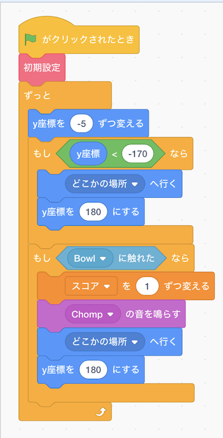

- 最後に、プログラムを保存してください。

    Finally, save the program.

