# 背景のプログラムの作り方(How to develop a background program)

## 1. プログラムを作る前の準備(Preparation before develop the program)

- Scratch 3.0を起動し、画面右下にある背景1をクリックします。

    Launch Scratch 3.0 and click on Background 1 at the bottom right of the screen.

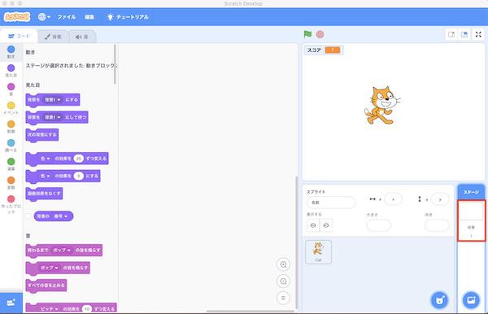

- 背景のタブをクリックし、を押します。

    Click on the Background tab and press .

- 以下の画面が表示されるので、背景を選択します。(例：Treeを選択。)

    The following screen will display and you can select a background. (For example, select Tree.)

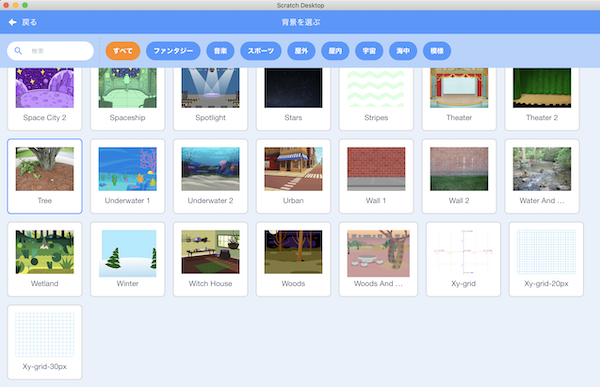

- 選んだ背景が追加されたことを確認後、『背景1』を選択し、右上の×ボタンを押して削除します。

    After confirming that the selected background has been added, select "Background 1" and press the x button at the top right to remove it.

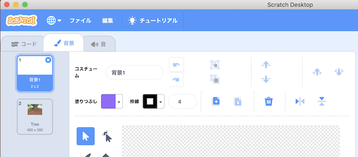

- 音のタブをクリック後、『ポップ』を選び、右上の×ボタンを押して削除します。

    Click on the sound tab, select "Pop" and press the x button in the upper right corner to remove it.

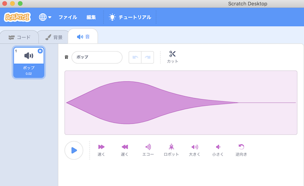

- を押すと、以下の画面が表示されるので、ループをクリックし、音楽を選択します。(例：Dance Aroundを選択)

    When you press , the following screen will display, click on Loop and select the music. (For example, select Dance Around).

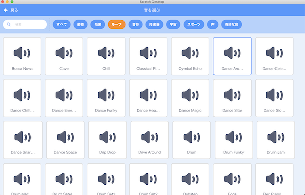

- 以下の画面が表示されれば、準備は完了です。

    When the following screen is displayed, the preparation is complete.

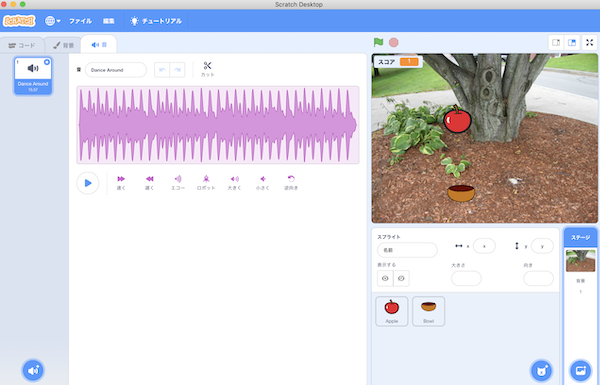

## 2. プログラムの作り方(How to develop a program)

### 2-1. 完成イメージ(Completed image)

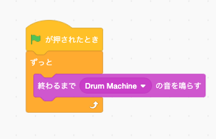

### 2-2. 作り方(How to develop)

- コードのタブを選択し、以下のブロックを画面中央にドラック＆ドロップします。

    Select the Code tab and drag and drop the following block to the center of the screen.

 

 

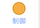 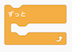

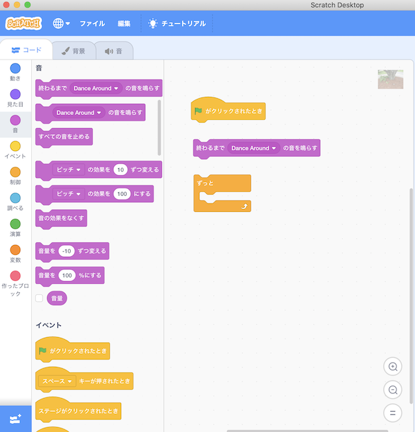

- ブロックをくっつけてください。これでプログラムは完成です。

    Connect the blocks.The program is complete.

- 最後に、プログラムを保存してください。

Finally, save the program.

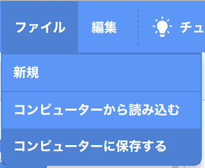
