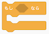

# ボウルのプログラムの作り方(How to develop a bowl program)

## 1. プログラムを作る前の準備(Preparation before develop the program)

- Scratch 3.0を起動し、スプライト1を削除する。(スプライト1を選択→×をクリック)

    Start Scratch 3.0 and delete sprite 1.(Select sprite 1　→　Click ×)

- ボタンをクリックする。

    Click on the  button.

- ボウル(Bowl)を選択、クリックする。

    Select a bowl and click on it.

- スプライトが設定されていることを確認する。

    Confirm that the selected sprite is set.

## 2. プログラムの作り方(How to develop a program)

### 2-1. 完成イメージ(Completed image)

### 3-2. 作り方(How to develop)

- 以下のブロックを画面中央にドラック＆ドロップします。

    Drag and drop the following blocks to the center of the screen.

  ×2 ×2

 

  ×4

 ×4

- のにをドラッグ＆ドロップします。(これを4回(ブロック数分)実行します。)

    Drag and drop  to  for .(Do this four times (for a few blocks).)

- の▼を押して、表示されるメニューで **『上向き矢印』を選択** します。 **残りのブロックに『下向き矢印』、『右向き矢印』、『左向き矢印』を設定** してください。

    Press ▼ on  and select "up arrow" in the menu that appears.
Set the "down arrow", "right arrow", and "left arrow" for the remaining blocks.

- **『上向き矢印』と『下向き矢印』を設定したブロック** にをくっつけます。

    Connect  to the blocks with the "up arrow" and "down arrow".

- **『下向き矢印』を設定したブロック** の数字を **-10に変更** します。(数字をダブルクリックすることで、数字を編集できる状態になります。)

    Change the number of the block with the "downeft arrow" to -10.(Double-clicking on a number, you will be able to edit the number.)

- **『右向き矢印』、『左向き矢印』を設定したブロック** にをくっつけます。

    Connect  to the blocks with the "right arrow" and "left arrow".

- **『左向き矢印』を設定したブロック** の数字を **-10に変更** します。(数字をダブルクリックすることで、数字を編集できる状態になります。)

    Change the number of the block with the "left arrow" to -10.(Double-clicking on a number, you will be able to edit the number.)

- の **x座標とy座標の数字を以下の画像の内容に変更** します。(数字をダブルクリックすることで、数字を編集できる状態になります。)

    Change the numbers in the x and y coordinates of  to the contents of the following image.(Double-clicking on a number, you will be able to edit the number.)

- ブロックをくっつけてください。これでプログラムは完成です。

    Connect the blocks.The program is complete.

